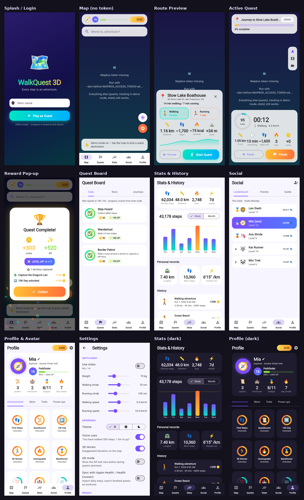

# WalkQuest 3D 🗺️🚶🏃

A real-world walking & running RPG for iOS and Android, built with **Flutter**,
**Mapbox Maps SDK v11** (3D buildings, terrain, model layers) and **Firebase**.

Pick a destination on a 3D map and see time, steps, calories and climb for
walking and running. Then walk or run there for real while your 3D avatar
moves along the route. Earn coins and XP, complete quests, capture territory
by walking loops, and climb your friends' weekly leaderboard.

- 📐 Design: [`docs/GAME_DESIGN.md`](docs/GAME_DESIGN.md) — game design document with wireframes and user stories
- 🔥 Backend: [`docs/FIREBASE_SETUP.md`](docs/FIREBASE_SETUP.md)



*Screens rendered from this codebase. The map area shows the no-token
placeholder; with a Mapbox token it renders the live 3D map.*

---

## Features

| Area | What's in |
|---|---|
| **Map** | Full-screen Mapbox Standard 3D map, live location puck, day/night light preset matching the app theme, 3D terrain, search bar, tap to choose a destination |
| **Route preview** | Mapbox Directions (walking), animated draw-in route with glow, casing and direction chevrons, elevation profile (Tilequery), cinematic camera fly-over, Walking/Running cards: *🕒 14 min walking / 7 min running · 👣 ~1,700 steps · 🔥 ~55 kcal* |
| **Live quest** | GPS (background-capable) + hardware pedometer, route snapping, 3D glTF avatar rotated to heading, gold "walked" gradient, progress bar, remaining distance/time/steps, kcal, coins, off-route and arrival detection, voice cues, pause/resume, Follow / Top-down / Cinematic cameras |
| **Gamification** | Coins (1 per 100 steps), XP (distance + speed + destination), levels and titles, 3 daily quests, 4-chapter story campaign with landmarks spawned near you, journey quests, territory capture by closed loops (3D extrusions on the map), 11 achievements, shop (3D skins, trail colors, power-ups), reward pop-up with confetti |
| **Stats** | Lifetime totals, weekly/monthly bar charts with a 10k line, personal records, history with Mapbox Static route thumbnails, session detail and sharing |
| **Social** | Friend codes, weekly leaderboard, step challenges, guilds with pooled weekly goals, route sharing |
| **Settings** | km/miles, weight, strides, walking/running speeds, theme (light/dark/system), voice cues, 3D terrain, AR toggle, Health sync, privacy (hide route ends, don't store routes, location sharing), Demo mode |
| **Backend** | Firebase Auth (anonymous → email linking), Firestore, security rules, Cloud Functions (anti-cheat, guild credit, weekly reset). Falls back to a fully offline local mode when Firebase isn't configured. |

## Project structure

```
walkquest_3d/
├── lib/
│   ├── main.dart                     # bootstrap: Mapbox token, Firebase (optional), providers
│   ├── app.dart                      # MaterialApp, light/dark themes
│   ├── models/                       # User, Quest, Route, WalkSession, Achievement, Territory, …
│   │   ├── user_profile.dart  quest.dart  route_plan.dart  walk_session.dart
│   │   ├── achievement.dart   territory.dart  shop_item.dart  social.dart
│   │   └── activity_mode.dart app_settings.dart  lat_lng.dart
│   ├── services/
│   │   ├── mapbox_api_service.dart   # Directions, Geocoding v6, Tilequery elevation, Static Images
│   │   ├── map_layer_controller.dart # 3D route/avatar/beacon/territory layers + camera modes
│   │   ├── route_calculator.dart     # time / steps / calories (ACSM MET)
│   │   ├── location_service.dart     # GPS permissions + background tracking stream
│   │   ├── step_counter_service.dart # pedometer → session steps (pause/reboot-safe)
│   │   ├── tracking_engine.dart      # pure: filtering, snapping, progress, milestones, loops
│   │   ├── gamification_service.dart # pure: coins, XP, levels, quests, achievements
│   │   ├── quest_service.dart        # daily / story / journey quests
│   │   ├── territory_service.dart    # loop detection → territory
│   │   ├── catalog.dart              # shop items + achievement rules
│   │   ├── voice_service.dart        # TTS cues
│   │   ├── health_service.dart       # HealthKit / Health Connect
│   │   ├── auth_service.dart         # Firebase Auth or local guest
│   │   └── repository.dart  firestore_repository.dart  local_repository.dart
│   ├── state/                        # ChangeNotifiers (provider)
│   │   ├── settings_controller.dart  game_controller.dart  tracking_controller.dart
│   ├── screens/
│   │   ├── splash_login_screen.dart  home_shell.dart (bottom nav)
│   │   ├── map_screen.dart           destination_search_screen.dart
│   │   ├── active_quest_screen.dart  quest_board_screen.dart
│   │   ├── stats_history_screen.dart session_detail_screen.dart
│   │   ├── social_screen.dart        profile_screen.dart  settings_screen.dart
│   ├── widgets/                      # QuestMapView, RoutePreviewPanel, ProgressRing, GameButton,
│   │                                 # RewardPopup, QuestCard, XpBar, ElevationChart, GlassPanel…
│   └── utils/                        # geo_utils, formatters, leveling, app_theme, env
├── test/                             # 31 unit tests for the pure game/geo/tracking logic
├── firebase/                         # firestore.rules, indexes, Cloud Functions
├── android/  ios/                    # platform projects with permissions configured
└── docs/                             # GDD + Firebase setup
```

## Requirements

- Flutter **3.38+** (Dart 3.10+). Developed and tested with Flutter 3.47.
- A **Mapbox access token** (public `pk.…`). Get one at <https://account.mapbox.com>.
  Mapbox SDK v11 doesn't need a secret download token.
- iOS 15+ / Xcode 16+, Android API 26+ (Health Connect requirement).
- Optional: a Firebase project (see [`docs/FIREBASE_SETUP.md`](docs/FIREBASE_SETUP.md)).

## Run

```bash
cd walkquest_3d
flutter pub get
flutter run --dart-define=MAPBOX_ACCESS_TOKEN=pk.your_token_here
```

To avoid retyping the token, keep it in a git-ignored file:

```bash
echo '{"MAPBOX_ACCESS_TOKEN":"pk.your_token_here"}' > env.json
flutter run --dart-define-from-file=env.json
```

### Try it without walking

Turn on **Profile → ⚙️ Settings → Demo mode**. Starting a quest then simulates
a walk along the route at 4× speed, which works in simulators and at your
desk. **Free Roam** (the orange flag button on the map) simulates a square
loop, so you can watch a territory get captured.

### Design preview (sample data)

`preview/main_preview.dart` seeds a player with two weeks of history and opens
a chosen screen. It runs anywhere, including Chrome:

```bash
flutter run -d chrome -t preview/main_preview.dart
# then add ?screen=home|route|quest|reward|login&theme=light|dark to the URL
```

### Tests & lint

```bash
flutter analyze
flutter test
```

## Build

### Android

```bash
flutter build apk --release --dart-define=MAPBOX_ACCESS_TOKEN=pk.…
flutter build appbundle --release --dart-define=MAPBOX_ACCESS_TOKEN=pk.…   # Play Store
```

- Release signing: add a keystore and a `signingConfigs.release` block in
  `android/app/build.gradle.kts` (it currently uses the debug key).
- Already configured: location (fine and background), foreground location
  service, notifications, activity recognition, Health Connect permissions
  and rationale activity, `FlutterFragmentActivity`, `minSdk 26`.
- Play Console: background location and Health Connect both need a
  declaration form.

### iOS

```bash
cd ios && pod install && cd ..
flutter build ipa --release --dart-define=MAPBOX_ACCESS_TOKEN=pk.…
```

- In Xcode (Runner → Signing & Capabilities), set your team, then add the
  **HealthKit** capability (only needed for Health sync) and
  **Background Modes → Location updates, Audio** (already in `Info.plist`).
- Already configured: usage strings for location, motion, and Health
  read/write; `UIBackgroundModes`; Podfile set to iOS 15 with
  `permission_handler` macros (location, sensors, notifications).

## How the key pieces work

**Route stats** (`RouteCalculator`): `time = distance / speed`,
`steps = meters / stride`, `kcal = MET × kg × hours`. MET comes from the ACSM
equations at the configured speed, plus the route's climb:
5 km/h → 3.4 MET and 10 km/h → 10.5 MET.

**Running routes:** Mapbox Directions has no running profile, so both modes
share the `walking` geometry. Only speed, stride and calories differ.

**3D rendering** (`MapLayerController`):

- Layers sit on Mapbox Standard, which provides 3D buildings and landmarks.
- Terrain comes from a `raster-dem` source.
- Route effects:
  - progress: a `line-gradient` step expression on `line-progress`
  - draw-in reveal: an animated `line-trim-offset`
  - direction arrows: a `SymbolLayer` of chevrons placed along the line
- The destination beacon is a `FillExtrusionLayer` hexagon.
- The avatar is a glTF model in a `ModelLayer`. Skins point at Khronos
  sample models on jsDelivr. To bundle your own, add
  `assets/models/hero.glb` and set the skin's `modelUri` to
  `asset://assets/models/hero.glb`. If you change models, tune
  `modelScale` and the rotation offset.

**Tracking** (`TrackingEngine`, pure Dart, unit-tested):

- Rejects fixes with accuracy worse than 35 m, jitter, and vehicle speeds.
- Snaps to the route inside a forward-only window, so out-and-back routes
  don't jump.
- Arrival is within 25 m of the destination; off-route is beyond 45 m.
- Emits milestone events, which `TrackingController` turns into voice cues
  and banners.

**Territory:** the engine checks whether the newest GPS point closes a loop
(≥ 400 m long, ≥ 2,000 m² area). The enclosed ring becomes a named
`Territory`.

## Notes & limitations

- **AR mode** is a settings toggle plus an in-quest entry point. The
  camera-overlay AR view (ARCore/ARKit or Unity ARFoundation) is on the
  roadmap and not yet implemented.
- **Offline mode:** without Firebase, the leaderboard uses simulated rivals,
  and guild join-by-ID needs Firestore.
- Firebase isn't configured in this repo: none of
  `google-services.json`, `GoogleService-Info.plist` or
  `firebase_options.dart` is committed, so the app starts in offline mode
  until you run `flutterfire configure`.
- `flutter analyze` and `flutter test` pass. Native builds still need the
  platform toolchains (Xcode / Android SDK) on your machine.
